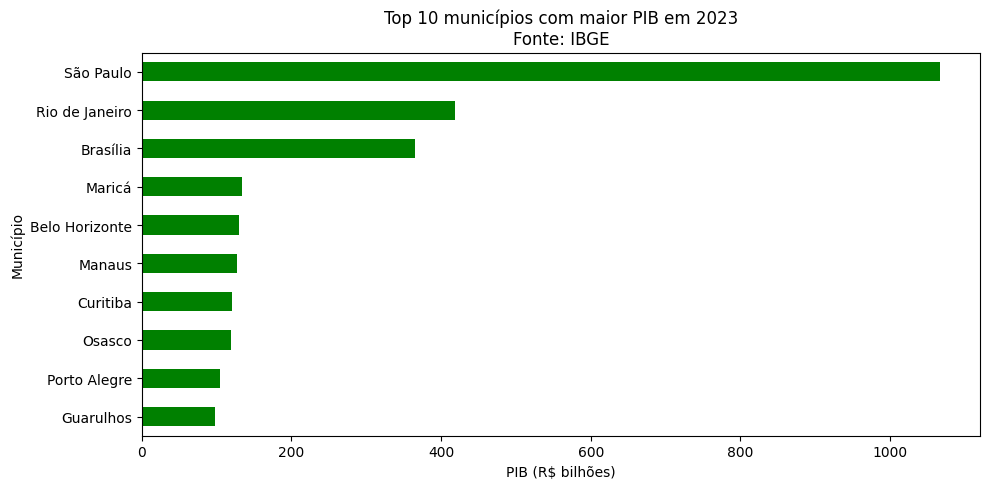
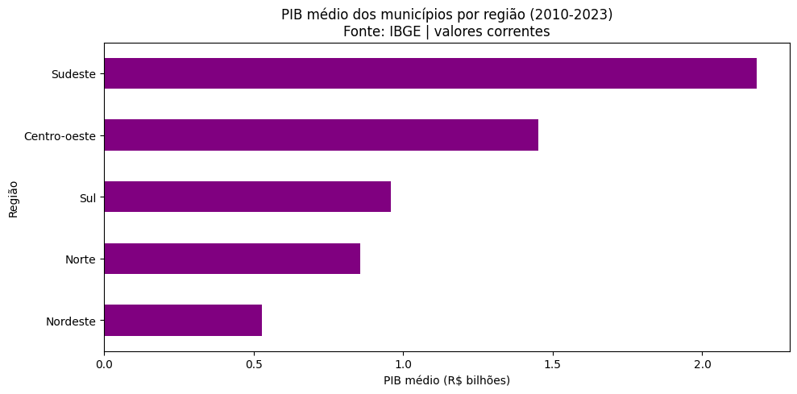
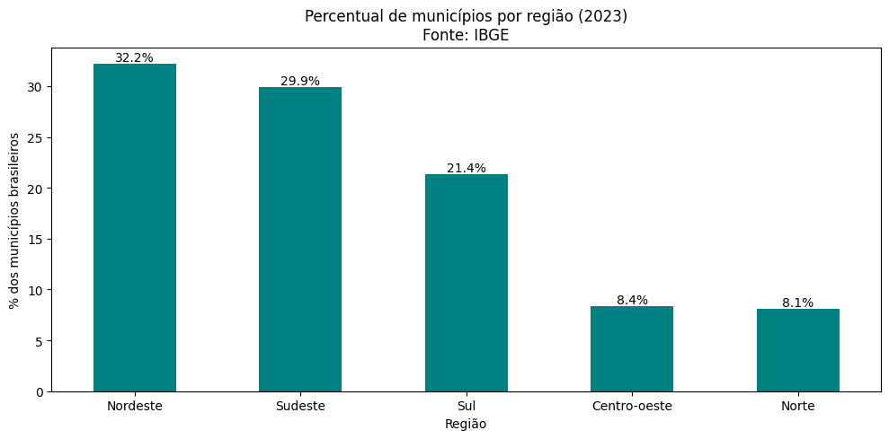

# Análise do PIB dos Municípios Brasileiros (2010–2023)

Projeto acadêmico de Business Intelligence desenvolvido para a disciplina **Laboratório de Inovação IV**, ministrada pelo Prof. Edilberto Silva, no curso de Tecnologia em Banco de Dados da Faculdade de Tecnologia e Inovação Senac-DF.

> **Status:** em andamento

## 🎯 Sobre o projeto

O objetivo deste projeto é analisar como o PIB dos municípios brasileiros evoluiu entre 2010 e 2023, comparando municípios, estados e regiões, utilizando a base de dados oficial do IBGE.

**Pergunta-chave:**
> Como o Produto Interno Bruto dos municípios brasileiros evoluiu entre 2010 e 2023 e quais municípios, estados e regiões apresentaram os maiores valores de PIB e PIB per capita?

## 👥 Equipe

- Daniel Reis Rodrigues
- Caio Nunes Lima

## 📊 Fonte de dados

- **IBGE — PIB dos Municípios (2010–2023)**
  Página oficial: https://www.ibge.gov.br/estatisticas/economicas/contas-nacionais/9088-produto-interno-bruto-dos-municipios.html
  Base utilizada: `PIB dos Municípios - base de dados 2010-2023.xlsx` (77.965 registros, 43 campos)
- Valores em R$ 1.000, a preços correntes (sem correção pela inflação).

> ⚠️ Para os anos de 2022 e 2023, o IBGE disponibilizou apenas o PIB e o PIB per capita (sem os dados por setor econômico).

## 📈 Análises realizadas

As análises abaixo foram feitas em Python (Pandas e Matplotlib) no Google Colab.

### 1. Top 10 municípios com maior PIB em 2023



Em 2023, os três maiores PIBs foram os de **São Paulo (SP), Rio de Janeiro (RJ) e Brasília (DF)**. Completam a lista Maricá (RJ), Belo Horizonte (MG), Manaus (AM), Curitiba (PR), Osasco (SP), Porto Alegre (RS) e Guarulhos (SP).

### 2. PIB médio dos municípios por região (2010–2023)



Considerando a média do período, a região **Sudeste** tem o maior PIB médio por município, seguida por Centro-Oeste, Sul, Norte e Nordeste. Por ser uma média, poucos municípios muito grandes podem influenciar o resultado de uma região (como no Centro-Oeste, que inclui Brasília).

### 3. Percentual de municípios por região (2023)



O **Nordeste** concentra a maior parte dos municípios (cerca de 32%), seguido por Sudeste (30%), Sul (21%), Centro-Oeste (8%) e Norte (8%). Este gráfico mostra a quantidade de municípios, e não o tamanho da economia de cada região.

## 🛠️ Ferramentas

- Python, Pandas e Matplotlib
- Google Colab
- Excel
- GitHub
- Power BI (dashboard previsto)

## 📁 Estrutura do repositório

```
projeto-bi-pib-municipios/
├── README.md
├── docs/
│   └── crisp-dm/          ← Fases do projeto (CRISP-DM)
├── dados/                 ← Base de dados do IBGE
├── notebooks/             ← Notebooks de análise (Google Colab)
├── images/                ← Gráficos usados neste README
└── power-bi/              ← Dashboard (quando estiver pronto)
```

## 📌 Fases do projeto

- [x] Fase 0 — Perguntas-chave (`docs/crisp-dm/00-perguntas-chave.md`)
- [x] Fase 1 — Entendimento do negócio
- [x] Fase 2 — Entendimento dos dados (notebook no Google Colab)
- [ ] Fase 3 — Preparação dos dados
- [ ] Fase 4 — Modelagem
- [ ] Fase 5 — Avaliação
- [ ] Fase 6 — Implantação (Deployment)

## ▶️ Como abrir a análise

1. Acesse o notebook no Google Colab: [https://colab.research.google.com/drive/1LsZc_c7JuvVfpjBTMQSry8O2R0_90QPE?usp=sharing].
2. Envie a base do IBGE para o Colab (ou para o Google Drive), no local indicado no notebook.
3. Execute as células em ordem (Ambiente de execução → Executar tudo).

## ℹ️ Observações

Este projeto tem fins acadêmicos e usa apenas dados públicos do IBGE.
